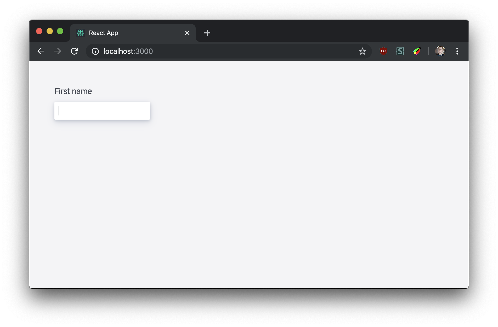
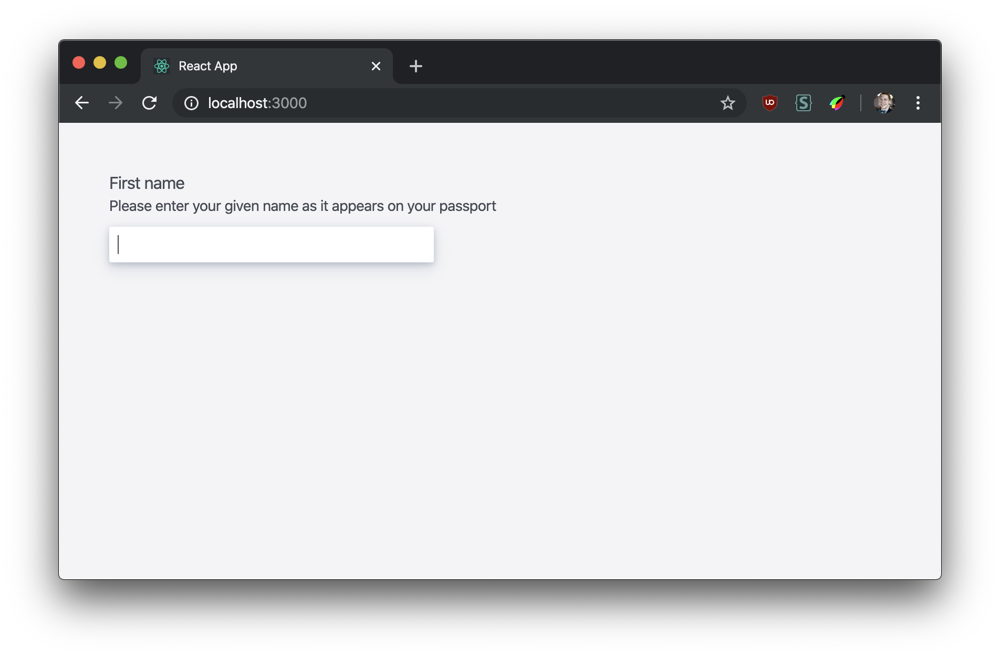
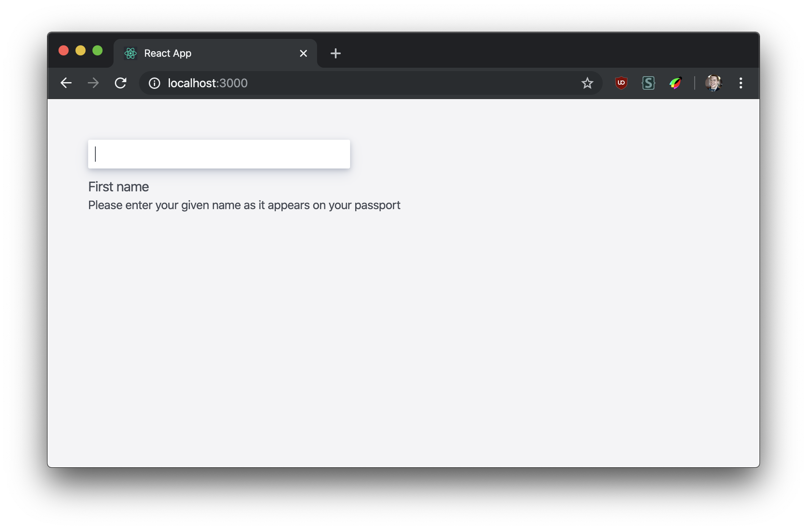
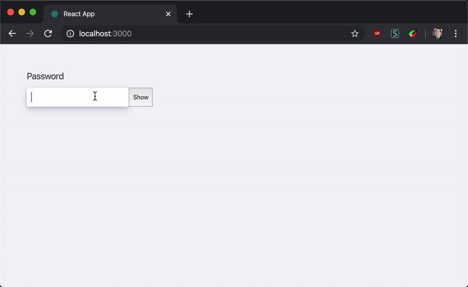

# Learn Advanced React: reusable components

Making truly flexible and reusable components can be tough. It's hard to predict future design or behaviour requirements, so it's best to create the most flexible API possible for your components.

## Learning outcomes

- [ ] Leveraging _composition_ to create flexible components
- [ ] Refactoring a monolithic component to a **compound component**
- [ ] Using context to communicate between children
- [ ] Build more complex components on top of compound components

## Part 0: setup

1. Clone this repo
1. `cd` into it and run `npm install`
1. Run `npm start` and open in your browser

Open the `src/InputField.jsx` file. It contains an input field component that renders a `<label>` and an `<input>`. It spreads any extra props onto the input element.

```jsx
<InputField id="first-name" label="First name" />
```



## Part 1: multiple labels

Your team's product owner has decided that users need a little more help: they want the label to also contain some smaller text with more info about what's required.

## Task

Edit the `InputField` component so that it can display smaller info text within the label. The rendered HTML should look like this:

```html
<div class="inputField">
  <label class="inputField__label" for="first-name">First name</label>
  <div class="inputField__info" id="first-name-info">
    Please enter your first name
  </div>
  <input
    class="inputField__input"
    id="first-name"
    aria-describedby="first-name-info"
  />
</div>
```

**Note**: we have to use [`aria-describedby`](https://developer.paciellogroup.com/blog/2018/09/describing-aria-describedby/) to associate the input with the info message, so it gets read out by screen-readers when the input is focused.



## Part 2: moving the label

Your designer has decided that on certain pages all the label text should appear _below_ the input itself.

### Task

Edit the `InputField` component so that it has _the option_ of rendering the label message below the input instead of above it.



## Interlude: avoiding the apropcalypse

Did your solutions to parts 1 & 2 add new props to the `InputField`? Can you see how this is unsustainable as design and behaviour requirements continually evolve?

Eventually you'll hit the [apropcalypse](https://twitter.com/gurlcode/status/1002110517094371328?lang=en), where your component takes 25 different configuration props.

```jsx
<InputField
  id="first-name"
  label="First name"
  info="Please enter your given name as it appears on your passport"
  showLabelBelow={true}
  labelClassName="bold"
  inputClassName="width-50"
  capitalizeLabel={false}
  trailingIcon={<EyeIcon size="32" />}
/>
```

We can look at how HTML works for a better pattern:

```html
<label for="fruit">Choose fruit</label>
<select id="fruit">
  <option>Apple</option>
  <option>Orange</option>
</select>
```

With a composable API like this the developer has full control over how and where each composite part is rendered. If they want to add a classname to the first `<option>` they can just do it themselves.

React components that work this way are usually called "compound components". Here's how using our `InputField` might look if it were a compound component:

```jsx
<InputField>
  <Label htmlFor="first-name">First name</Label>
  <Info id="first-name-info">
    Please enter your given name as it appears on your passport
  </Info>
  <Input id="first-name" />
</InputField>
```

The developer using the component can now move the labels below the input without needing any special props.

Since the components compose together developers already know how to use them. They can make all kinds of variants without ever touching the underlying component, by re-ordering them or adding classnames etc.

## Part 3: compound components

Let's refactor the `InputField` to support the above compound component API. You'll need to export several small components from the file, instead of one monolithic one.

### Task

Edit `src/index.jsx` to render the component how we'd like:

```jsx
import { InputField, Label, Info, Input } from "./InputField.jsx";

function App() {
  return (
    <InputField>
      <Label htmlFor="first-name">First name</Label>
      <Info id="first-name-info">
        Please enter your given name as it appears on your passport
      </Info>
      <Input id="first-name" />
    </InputField>
  );
}
```

Then refactor `InputField` to make this composable API work. The end result on the page should look the same as after part 2.

### Hints

Good compound components should behave like HTML elements. They shouldn't "swallow" props—for example if they receive a classname they should pass it on to their underlying DOM element. This ensures they can be easily styled/customised.

## Part 4: context

Our compound component is nice, but it actually has a regression in developer experience. We now have to manually pass IDs to each element to ensure everything is connected up accessibly. With the single `<InputField id="blah" />` component this is all handled for us.

Ideally we could pass the ID once and not worry about the other elements, like this:

```jsx
<InputField id="first-name">
  <Label>First name</Label>
  <Info>Please enter your given name as it appears on your passport</Info>
  <Input />
</InputField>
```

But how can our sub-components have access to a prop passed to the top-level one?

We can communicate across component boundaries in two ways in React.

First, we can pass props. This won't work here since the `InputField` no longer renders these sub-components, so it can't pass any props.

The second is [React context](https://reactjs.org/docs/context.html). This is a way to bypass the component tree and access values directly in the children. Here's a simplified example:

```jsx
const ExampleContext = React.useContext();

function Example({ children }) {
  const isOpen = false;
  return (
    <ExampleContext.Provider value={isOpen}>{children}</ExampleContext.Provider>
  );
}

function Child() {
  const isOpen = React.useContext(ExampleContext);
  return <div>{isOpen ? "open" : "closed"}</div>;
}

function App() {
  return (
    <Example>
      <div>
        <section>
          <Child />
        </section>
      </div>
    </Example>
  );
}
```

No matter how deep down the component tree `Child` is rendered it can still access the `isOpen` value from the parent `Example` using the [`useContext`](https://reactjs.org/docs/hooks-reference.html#usecontext) hook.

This is perfect for compound components: it allows the parent component to share props and state with whatever was rendered inside of it.

### Task

Edit `src/index.jsx` to only pass a single ID:

```jsx
<InputField id="first-name">
  <Label>First name</Label>
  <Info>Please enter your given name as it appears on your passport</Info>
  <Input />
</InputField>
```

Refactor your components using context to make this API work. Use context to make the `id` available to the children so they can correctly set the attributes they need. The end result should look the same as after part 3.

## Part 5: password input

Our compound component is flexible enough that we can build more complex components using the pieces, without touching the underlying `InputField`.

Let's build a `PasswordField` component that lets users click a button to toggle their password visible/hidden.

### Task

Editing **only** `src/index.jsx` use your `InputField` compound component to create a toggle-able password input.

<details>
<summary>Click for a hint:</summary>

You can make the text in an `<input type="password">` visible by changing it to `type="text"`.

</details>


