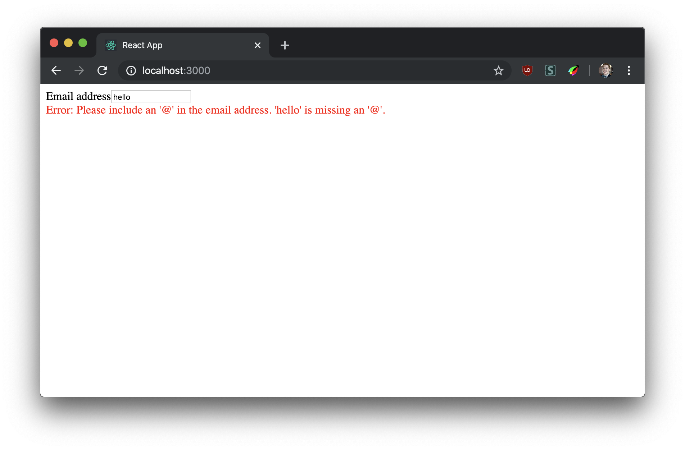
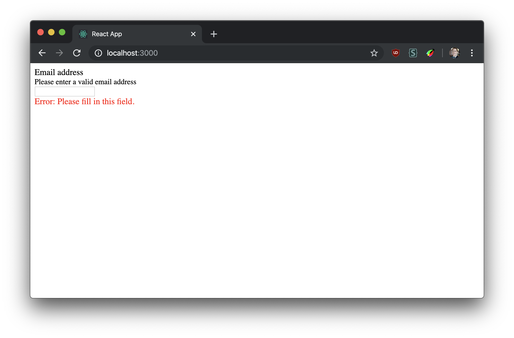
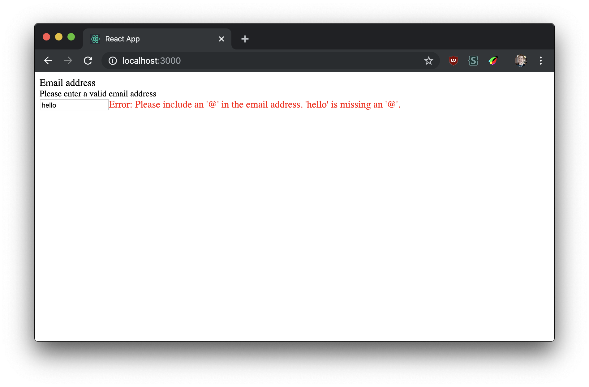

# Learn Advanced React: reusable components

Making truly flexible and reusable components can be tough. It's hard to predict future design or behaviour requirements, so it's best to create the most flexible API possible for your components.

## Learning outcomes

- [ ] Leveraging _composition_ to create flexible components
- [ ] Refactoring a monolithic component to a **compound component**
- [ ] Using context to communicate between children
- [ ] Build more complex components on top of compound components

## Part 0: setup

1. Clone this repo
1. `cd` into it and run `npm install`
1. Run `npm start` and it should automatically open in your browser

Open the `src/InputField.js` file. It contains an input field component that renders a label, an input and the browser default validation message when the user leaves the input (if there is one).

```jsx
<InputField id="email" label="Email address" type="email" required />
```



## Part 1: multiple labels

Your team's product owner has decided that users need a little more help: they want the label to also contain some smaller text with more info about what's required.

## Task

Edit the `InputField` component so that it can display a smaller sub-label with an explanation of what the user is supposed to enter.



## Part 2: inline validation

Your designer has decided that on certain pages the validation should appear _next to_ the input rather than below.

### Task

Edit the `InputField` component so that it has the option of rending the validation message next to the input instead of below it.



## Interlude: avoiding the apropcalypse

Did your solutions to parts 2 & 3 add new props to the `InputField`? Can you see how this is unsustainable as design and behaviour requirements continually evolve?

Eventually you'll hit the [apropcalypse](https://twitter.com/gurlcode/status/1002110517094371328?lang=en), where your components takes 25 different configuration props.

We can look at how HTML works for a better API: one that the developer using the component can _compose_:

```html
<label for="fruit">Choose fruit</label>
<select id="fruit">
  <option>Apple</option>
  <option>Orange</option>
</select>
```

With a composable API the developer has full control over how and where each composite part is rendered.

In React components that work this way are usually called _compound components_. Here's how our `InputField` might look as a compound component:

```jsx
<InputField id="email">
  <Label>Email address</Label>
  <Input type="email" required />
  <Validation />
</InputField>
```

Now the changes from parts 2 & 3 are relatively simple:

```jsx
<InputField id="email">
  <Label>
    <div>Email address</div>
    <div style={{ fontSize: 14 }}>Please enter a valid email address</div>
  </Label>
  <div style={{ display: "flex" }}>
    <Input type="email" required />
    <Validation />
  </div>
</InputField>
```

Since the components compose together developers already know how to use them. We can make all kinds of variants without ever touching the underlying component.

### React context

You may be wondering how those sub-components have access to the state values in the parent. We can communicate across component boundaries in two ways in React.

First, we can pass props. This won't work here since the `InputField` no longer renders these sub-components, so it can't pass any props.

The second is React context. This is a way to bypass the usual component tree and access values directly from the children. Here's a simplified example:

```jsx
const ExampleContext = React.useContext();

function Example() {
  const [toggle, setToggle] = React.useState(false);
  return (
    <ExampleContext.Provider value={{ toggle, setToggle }}>
      {children}
    </ExampleContext.Provider>
  );
}

function Child() {
  const { toggle, setToggle } = React.useContext(ExampleContext);
  return <div>{toggle ? "open" : "closed"}</div>;
}

function App() {
  return (
    <Example>
      <div>
        <section>
          <Child />
        </section>
      </div>
    </Example>
  );
}
```

See how this allows us a child deeper in the tree to access values without passing them as props?

## Part 3: compound component

Let's refactor the `InputField` to support the above compound component API. You'll need to export several sub-components instead of one monolithic one and use React context to communicate between them.

### Task

Edit `src/index.js` to render this inside of `App`:

```jsx
<InputField id="email">
  <Label>Email address</Label>
  <Input type="email" required />
  <Validation />
</InputField>
```

Refactor `InputField` to make this composable API work. The end result should be the same as part 1.
